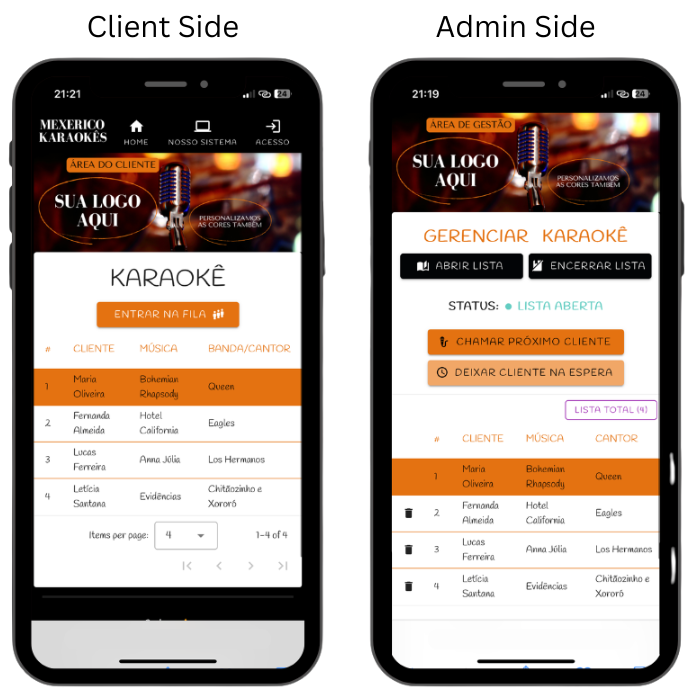

  # Karaoke Queue Manager
  <div align="center">
  
  **A modern, scalable solution designed to revolutionize the karaoke experience with a strong focus on UI/UX and real-time synchronization.**

  [](https://vuejs.org/)
  [](https://vuetifyjs.com/)
  [](https://firebase.google.com/)
  []()
</div>

## 🚀 Product Overview

The **Karaoke Queue Manager** is an application built to solve a classic usability problem in entertainment venues: the disorganization of karaoke queues (often managed with paper slips or static spreadsheets). 

This platform delivers a **frictionless experience** for bar patrons and powerful control tools for administrators (KJs/DJs), all synchronized instantly across devices.

<br />

<div align="center">
  
</div>

<br />

---

## 💼 Business Value & Real-World Validation

This project goes beyond a simple portfolio piece. It was developed following a genuine product lifecycle:
- **Market Research:** Conducted field research with local bar owners and KJs to understand their true pain points in managing high-volume karaoke nights.
- **Product-Market Fit:** MVP testing was conducted directly with the public in real-world scenarios to validate usability and adherence.
- **Commercial Success:** The product proved its value, resulting in actual B2B sales and active paying clients (local venues) who now rely on the platform to run their events smoothly.

---

## 🧠 Architecture and Technical Decisions (Tech Stack)

This project was engineered to demonstrate proficiency in modern front-end ecosystems, component-based architecture, and Backend-as-a-Service (BaaS) integrations.

### ⚡ Front-End: Vue.js 3 & Vuetify
- **Vue 3:** Leverages Vue's modern reactivity system to handle the complex state of dynamic queues. The project employs a Multi-Page Application (MPA) architecture configured via `vue.config.js`. This separates contexts (Home, Admin, Clients) and optimizes load times through native Code Splitting.
- **Vuetify 3 (Material Design):** The interface was built using the Vuetify design system, ensuring visual consistency, native accessibility (a11y), and rapid prototyping of rich components like Modals, Cards, and AppBars.

### 🔄 Back-End & Synchronization: Firebase
- **Firebase Realtime Database:** The core of the system. It uses persistent WebSockets connections so any changes made by the admin (e.g., calling the next singer, closing the list) are reflected on all clients' screens in *milliseconds*, eliminating the need for polling or manual page reloads.
- **Firebase Authentication:** Implements security layers and session persistence (`browserSessionPersistence`) to protect the administration dashboard from unauthorized access.

---

## 🎨 UI/UX Engineering Highlights

When developing this application, the end-user experience was at the center of every architectural decision:

1. **Frictionless Onboarding (Zero Login):** Bar patrons don't want the hassle of creating accounts or passwords. The public interface allows users to add their name and song choice instantly—the lowest possible barrier to entry for higher conversion rates.
2. **Mobile-First Design:** Recognizing that 99% of users access the system from their tables using smartphones, the interface was strictly designed with a mobile-first approach. It features large touch targets, thumb-friendly buttons, and highly readable fonts optimized for low-light environments (native Dark Mode).
3. **Immediate Visual Feedback:** When the administrator "locks" the waiting list (temporarily closing sign-ups), the submission button on the client's phone is disabled in real-time, accompanied by clear visual state indicators.
4. **Intuitive Admin Dashboard:** Administrators process a high volume of data quickly. The Admin UI is designed for speed, featuring 1-click actions to remove, call, or reposition clients in the queue.

---

## ✨ System Features

### 📱 Client Experience (Public App)
- Quick and seamless queue insertion.
- Live view of the current singer on stage.
- Real-time tracking of personal position in the queue.
- Smart locking mechanism (listens dynamically to the admin's list state).

### 🎛️ Admin Dashboard (Protected Route)
- Secure authentication for management users.
- Global queue state control ("List Open" / "List Closed").
- Complete CRUD management of queue participants.
- Session history logging for sung tracks.

---

## 💻 Running the Project Locally

### Prerequisites
- Node.js (v16+) and NPM installed.

### Installation Steps

1. **Clone the repository:**
   ```bash
   git clone https://github.com/your-username/karaoke-queue-manager.git
   cd karaoke-queue-manager
   ```

2. **Install dependencies:**
   ```bash
   npm install
   ```

3. **Environment Setup (Firebase):**
   Create a `.env` file in the project root based on `.env.example`:
   ```env
   VUE_APP_FIREBASE_API_KEY=your_api_key
   VUE_APP_FIREBASE_AUTH_DOMAIN=your_auth_domain
   VUE_APP_FIREBASE_PROJECT_ID=your_project_id
   VUE_APP_FIREBASE_STORAGE_BUCKET=your_storage_bucket
   VUE_APP_FIREBASE_MESSAGING_SENDER_ID=your_sender_id
   VUE_APP_FIREBASE_APP_ID=your_app_id
   VUE_APP_FIREBASE_MEASUREMENT_ID=your_measurement_id
   ```

4. **Start the Development Server:**
   ```bash
   npm run serve
   ```
   > Access the app at `http://localhost:8080/`. The project supports *Hot-Module Replacement* (HMR).

5. **Production Build:**
   ```bash
   npm run build
   ```

---

<br />

<div align="center">
  <i>Developed with a focus on scalability, usability, and high-performance front-end engineering.</i>
</div>
